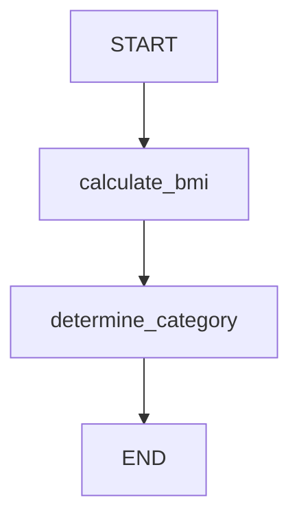

# Building a BMI Calculator with LangGraph: A Step-by-Step Guide
{: .no_toc }
<br>


<br>

<details open markdown="block">
  <summary>
    Table of contents
  </summary>
  {: .text-delta }
1. TOC
{:toc}
</details>

When building complex applications that require multiple processing steps, traditional linear workflow can become difficult to manage and scale. This is where [LangGraph](https://www.langchain.com/langgraph) comes – a powerful framework that allows to create state-driven workflows using graph-based architectures.

In this tutorial, we'll build a Body Mass Index (BMI) calculator using LangGraph to demonstrate how to create a simple yet effective multi-step workflow.


## What is LangGraph?

LangGraph is a library for building stateful, multi-actor applications with LLMs. It extends LangChain's capabilities by providing a graph-based approach to workflow management, where each node represents a specific operation and edges define the flow between operations.

## Setting Up the Dependencies

First, let's examine the imports we need:

```python
from langgraph.graph import StateGraph,START,END
from langchain_openai import ChatOpenAI
from typing import TypedDict
from dotenv import load_dotenv
```

**Key components:**
- `StateGraph`: The core graph structure
- `START, END`: Special nodes marking workflow beginning and end
- `TypedDict`: Ensures type safety for our state structure
- `dotenv`: For environment variable management

## Defining the State Structure

The foundation of any LangGraph workflow is a well-defined state:

```python
class BMIState(TypedDict):

    weight_in_kg: float
    height_in_m: float
    bmi: float
    category: str
```

This `TypedDict` serves as our data contract, ensuring that:
- Input values are properly typed
- All nodes can access required data
- The state remains consistent throughout the workflow

## Implementing the BMI Calculation

The first processing node calculates the BMI:

```python
def calculate_bmi(state: BMIState) -> BMIState:

    weight = state['weight_in_kg']
    height = state['height_in_m']

    bmi = weight / (height ** 2)

    state['bmi'] = round(bmi, 2)

    return state
```

The above code block:
- Takes the current state as input
- Extracts weight and height values
- Applies the BMI formula: `weight / height²`
- Rounds the result to 2 decimal places
- Updates the state with the calculated BMI


The `label_bmi_category` function defined below takes the calculated BMI value from the state. It compares the BMI against standard thresholds (18.5, 25, 30) to assign appropriate health categories: `underweight`, `Normal weight`, `Overweight`, or `Obese`. The function then updates the state with the determined category and returns the modified state for use in the next step of the workflow.

```python
def label_bmi_category(state: BMIState) -> BMIState:
    bmi = state['bmi']
    
    if bmi < 18.5:
        category = "Underweight"
    elif 18.5 <= bmi < 25:
        category = "Normal weight"
    elif 25 <= bmi < 30:
        category = "Overweight"
    else:
        category = "Obese"
    
    state['category'] = category
    return state
```

## Building the Graph Structure

Now we create and configure our workflow graph:

```python
# define the graph
graph = StateGraph(BMIState)

# add nodes
graph.add_node('calculate_bmi', calculate_bmi)
graph.add_node('determine_category', label_bmi_category)

# add edges
graph.add_edge(START, "calculate_bmi")
graph.add_edge("calculate_bmi", "determine_category")
graph.add_edge("determine_category", END)

```

## Executing the Workflow

Finally, we compile and run the workflow:

```python
# Compile the graph
workflow = graph.compile()
```
The workflow we have,



Now, we will test the workflow with an example,

```python
# Execute the graph
initial_state = BMIState(weight_in_kg=70, height_in_m=1.75)
final_state = workflow.invoke(initial_state)
print(final_state)
```
that gives the output:

```yaml
{
    'weight_in_kg': 70, 
    'height_in_m': 1.75, 
    'bmi': 22.86, 
    'category': 'Normal weight'
}
```


LangGraph provides an efficient solution for building multi-step workflows. Our BMI calculator demonstrates how to:
- Define typed state structures
- Create processing nodes
- Build workflow graphs
- Execute stateful operations

This pattern scales beautifully for more complex applications involving LLMs, external APIs, and advanced business logic.
