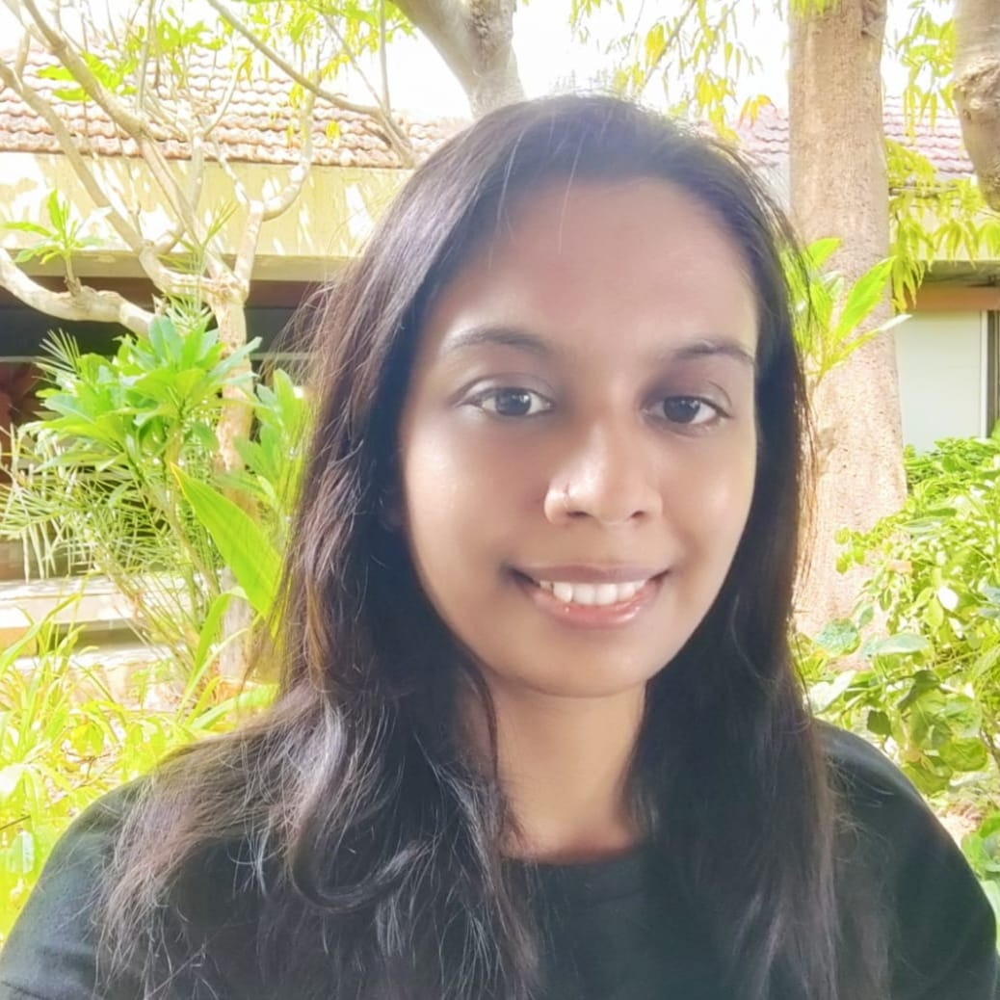

# Ankita Mungalpara

 

I’m a researcher and data scientist with hands-on experience in computer vision, deep learning, and generative AI. My current work focuses on advancing agentic AI and multimodal large language models (LLMs). I hold a Master of Science in Data Science from the University of Massachusetts Dartmouth.

With over three years of industry experience in data science and machine learning, I’ve built scalable, real-world AI solutions—from working as an ML Engineer at Tiger Analytics to developing a conversational LLM agent during my Summer 2024 internship at Johnson & Johnson Innovative Medicine.

I'm passionate about solving complex problems, pushing the boundaries of AI research, and transforming emerging ideas into impactful, real-world solutions.

  

  

  <a href="https://substack.com/@ankitamungalpara" target="_blank">
    

  
  </a>

# All Projects

 

This is a collection of my hands-on projects in agentic AI, generative AI, LLMOps, computer vision, and MLOps. Each project jumps into a key concept or framework in AI and ML, often supported by practical implementations or tutorials.

1. [Multimodal Video RAG Agent](docs/agentic-ai/multimodel-video-agent.html)
2. [Model Context Protocol (MCP)](docs/agentic-ai/2025-04-05-mcp.html)
3. [Managing Memory, Context, and State in an AI Agent](docs/agentic-ai/memory_context_in_agent.html)
4. [Document Intelligence: Modern Approaches to Extracting Structured Information](docs/generative-ai/document-ai/index.html)
    - [Part 1: Document Parsing with PaperMage](docs/generative-ai/document-ai/01_document_parsing_with_papermage.html)
    - [Part 2: Document Parsing with DONUT](docs/generative-ai/document-ai/02_document_arsing_with_DONUT.html)
    - [Part 3: Document Parsing with Nougat](docs/generative-ai/document-ai/03_document_parsing_with_Nougat.html)
    - [Part 4: Document Parsing with GOT-OCR2.0](docs/generative-ai/document-ai/04_Document_understanding_with_GOT_OCR2.0.html)
    - [Part 5: Document Parsing with MierU](docs/generative-ai/document-ai/05_document_understanding_with_MinerU.html)
5. [Advanced RAG](docs/generative-ai/advanced-rag/index.html)
6. [Building CLIP From Scratch](docs/generative-ai/2025-02-21-clip-from-scratch.html)
7. [Fine-Tune Mistral-7B Model with LoRA: Sentiment Classification](docs/generative-ai/2025-04-05-finetune-with-lora.html)
8. [Fine-Tune Mistral-7B Model with QLoRA: Financial Q&A](docs/generative-ai/finetune-with-qlora.html)
9. [LLM From Scratch](docs/generative-ai/llm-from-scratch/index.html)
    - [Part 1: How LLMs Read Text: Tokenization, BPE, and Word Embeddings Explained](docs/generative-ai/llm-from-scratch/00_working-with-text-data.html)
    - [Part 2: Self Attention Explained without Trainable Weights](docs/generative-ai/llm-from-scratch/01_Self_Attention_In_Work_Part_1.html)
    - [Part 3: Attention From Scratch: Self-Attention to Multi-Head Attention](docs/generative-ai/llm-from-scratch/02_Attention_From_Scratch_SelfAttention_to_MultiHead.html)
10. [Generative AI with LangChain](docs/generative-ai/langchain/index.html)
11. [NLP with Hugging Face](docs/generative-ai/nlp-with-huggingface/index.html)
12. [Kubernetes: Ingress & FastAPI Model Deployment](docs/mlops/deploying-fastAPI-models-on-k8s-with-ingress.html)
13. [YOLOv5 Custom Object Detection](docs/computer-vision/yolo-object-detection.html)
14. [Docker Compose and PyTorch Lightning](docs/mlops/docker-compose.html)
15. [Hyperparameter Tuning and Experiment Tracking](docs/mlops/hyperparameter-tuning.html)
16. [Deployment with Gradio](docs/mlops/deployment-with-gradio.html)
17. [Deployment with Litserve](/docs/mlops/deployment-with-litserve.html)

<!-- 
<section class="project-categories-grid">
  <a href="/docs/agentic-ai/index.html" class="category-tile">Agentic AI</a>
  <a href="/docs/computer-vision/index.html" class="category-tile">Computer Vision</a>
  <a href="/docs/generative-ai/index.html" class="category-tile">Generative AI</a>
  <a href="/docs/mlops/index.html" class="category-tile">MLOps</a>
</section> -->

# Certification

 

  <a href="https://learn.microsoft.com/en-us/users/ankitamungalpara-0103/credentials/92d5dc7947b76e29" class="cert-link">
    
    

      <strong>Microsoft Certified: Azure Data Scientist Associate</strong> 
    

  </a>

# Publication

 

  <a href="/docs/publication/" class="publication-link" target="_blank">
    
    

      <strong>Forest Stand Height Estimation using Inversion of RVoG Model over Forest of North-Eastern India</strong> 
      <em>Ankita Mungalpara, Dr. Sanid Chirakkal, Dr. Deepak Putrevu, Prof. Suman Mitra</em> 
      Presented at CAJG 2020 
      Published in <em>Advances in Science, Technology & Innovation</em>, Springer
    

  </a>

# Recent Blogs

 

<section class="recent-blogs">
  

    <article class="blog-card">
    <a href="docs/agentic-ai/2025-04-05-mcp.html" class="blog-link">
    

    

      <h3>Understanding MCP <em>(Model Context Protocol)</em></h3>
      
Published · May 10 2025

      <!-- tag chips -->
      

        Agentic AI
        Model Context Protocol (MCP)
        Generative AI
      

      <!-- clamped preview -->
      

        In today's fast-paced AI era, one of the most difficult tasks for developers is seamlessly connecting large language models (LLMs) to the data sources and tools required...
      

      <!-- Read more → -->
      <a href="docs/agentic-ai/2025-04-05-mcp.html" class="read-more">Read more →</a>
    

    </a>
    </article>

    <article class="blog-card">
    <a href="docs/generative-ai/2025-04-05-finetune-with-lora.html" class="blog-link">
    

    

      <h3>How I Fine-Tuned Mistral-7B Model with LoRA <em>(Low-Rank Adaptation)</em></h3>
      
Published · May 10 2025

      <!-- tag chips -->
      

        SFT
        PEFT
        Post-Training LLMs
        Generative AI
      

      <!-- clamped preview -->
      

        Large Language Models (LLMs) are initially trained on vast, different text corpora scraped from the internet. This pre-training phase teaches them statistical...
      

      <!-- Read more → -->
      <a href="docs/generative-ai/2025-04-05-finetune-with-lora.html" class="read-more">Read more →</a>
    

    </a>
    </article>

    <article class="blog-card">
    <a href="docs/generative-ai/2025-02-21-clip-from-scratch.html" class="blog-link">
    

    

      <h3>Building CLIP <em>(Contrastive Language–Image Pre-training)</em> From Scratch</h3>
      
Published · May 10 2025

      <!-- tag chips -->
      

        CLIP Training
        Multi-Head Attention
        Positional Embedding
      

      <!-- clamped preview -->
      

        Contrastive Language-Image Pre-training (CLIP) was developed by OpenAI and first introduced in the paper “Learning Transferable Visual Models From Natural...
      

      <!-- Read more → -->
      <a href="docs/generative-ai/2025-02-21-clip-from-scratch.html" class="read-more">Read more →</a>
    

    </a>
    </article>

  

</section>

Feel free to connect or explore more on my [GitHub](https://github.com/AnkitaMungalpara) or [LinkedIn](https://www.linkedin.com/in/ankita-mungalpara).

